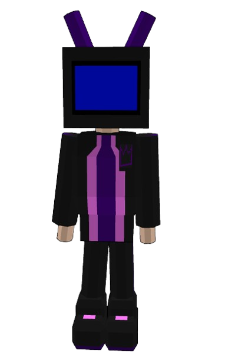

<div align="center">

# `>_ SYSTEM ONLINE`




### `Olá, eu sou [ABRAÂO]`

**Desenvolvedor • Criador de projetos • Explorador de tecnologia**

> Transformando ideias em experiências digitais, uma linha de código por vez.

<br/>


</div>

---

## `> whoami`

```yaml
name: "[SEU NOME]"
username: "[SEU_USUARIO_GITHUB]"
location: "Brasil 🇧🇷"
role: "Desenvolvedor e criador independente"
currently_learning:
  - Desenvolvimento web
  - JavaScript
  - Interfaces modernas
  - Automação e privacidade digital
interests:
  - Tecnologia
  - Programação
  - Design de interfaces
  - Projetos criativos
  - Games
```

Gosto de transformar conceitos em projetos funcionais, explorar novas tecnologias e criar interfaces que sejam tão agradáveis de usar quanto interessantes de construir.

Meu objetivo é unir **código, criatividade e personalidade** em cada projeto.

---

## `> tech_stack`

<div align="center">

### Linguagens & Desenvolvimento


### Ferramentas & Ambiente


</div>

---

## `> current_missions`

<table>
<tr>
<td width="50%" valign="top">

### 🚀 Construindo

- Projetos web autorais
- Interfaces com visual futurista
- Ferramentas pessoais em HTML, CSS e JavaScript
- Experiências digitais com foco em usabilidade

</td>
<td width="50%" valign="top">

### 🧠 Explorando

- Modelagem 3D
- Automação de tarefas
- Privacidade online
- Novas formas de integrar tecnologia e criatividade

</td>
</tr>
</table>

---

## `> featured_projects`

> Alguns projetos que representam minha jornada criativa.

<table>
<tr>
<td width="50%" valign="top">

### 🎮 Game Wishlist

Uma interface para organizar jogos, acompanhar desejos e gerenciar uma coleção pessoal.

**Stack:** HTML • CSS • JavaScript

</td>
<td width="50%" valign="top">

### 🎧 Offline Playlist

Uma ferramenta simples para guardar e organizar links de vídeos usando armazenamento local do navegador.

**Stack:** HTML • JavaScript • LocalStorage

</td>
</tr>
<tr>
<td width="50%" valign="top">

### 🏫 School Website

Site institucional com aparência moderna, responsiva e identidade visual personalizada.

**Stack:** HTML • CSS • JavaScript

</td>
<td width="50%" valign="top">

### 🤖 Personal AI

Experimentos e projetos voltados à criação de ferramentas inteligentes e experiências personalizadas.

**Stack:** Em desenvolvimento

</td>
</tr>
</table>

---

## `> github_activity`

<div align="center">


</div>

---

## `> connect`

<div align="center">

<a href="https://github.com/SEU_USUARIO_GITHUB">
  
</a>
<a href="https://www.linkedin.com/in/SEU_LINKEDIN/">
  
</a>
<a href="https://www.youtube.com/@SEU_CANAL">
  
</a>

<br/><br/>

```text
┌──────────────────────────────────────────────┐
│  Thanks for visiting my digital workspace!   │
│                                              │
│  Keep creating. Keep learning. Keep coding.  │
└──────────────────────────────────────────────┘
```


</div>
